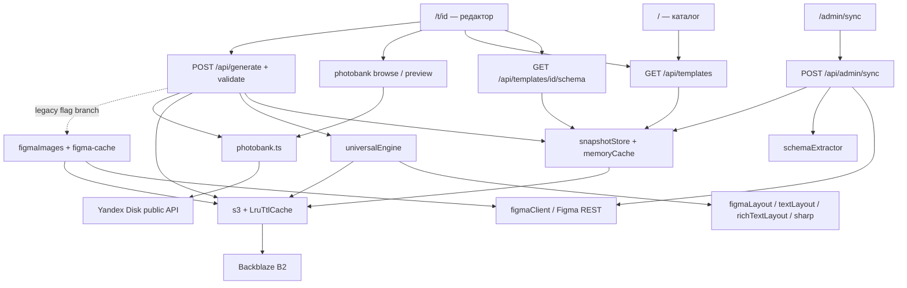

# Архитектура существующего Cherkizovo Design Service

Аудит 07.09.2026. Описывается код на `b6400a95e8e26bd35c4dbba6cff79c6c9e555f64`, исходной точке ветки `chore/2026-architecture-audit`. Это CURRENT STATE, а не проект версии 2026. Целевые требования и расхождения вынесены в [матрицу требований](REQUIREMENTS_TRACEABILITY_2026.md), [карту миграции](MIGRATION_2026.md) и [технический долг](TECH_DEBT_2026.md).

## Основания и границы проверки

Источником текущего поведения служат tracked-файлы `app/`, все модули `lib/`, декларации `types/`, конфигурация, package manifest и lockfile. README и baseline-документы использованы только после исследования кода. Ссылки `файл:строка` далее относятся к указанному SHA, номера обозначают начало соответствующего блока. Наличие кода не означает успешной проверки production.

Общие обозначения evidence во всех четырёх audit-документах: `editor` — `app/t/[id]/page.tsx`, `RichColorTextField.tsx` — соседний `app/t/[id]/RichColorTextField.tsx`; `globals` — `app/globals.css`, `ui` — `app/ui.tsx`. Имена модулей без каталога (`s3.ts`, `schemaExtractor.ts`, `universalEngine.ts`, `env` и другие) относятся к `lib/`. `generate`, `templates`, `schema API`, `sync route` обозначают соответственно `app/api/generate/route.ts`, `app/api/templates/route.ts`, `app/api/templates/[id]/schema/route.ts`, `app/api/admin/sync/route.ts`; остальные API указаны в инвентаре ниже. Сокращённое `:строка` наследует последний названный файл в ячейке. Для отсутствующей функциональности доказательство — совокупность инвентаря маршрутов, моделей и прослеженных вызовов, а не отсутствие отдельного ключевого слова.

Проверка продолжения 08.09.2026: выполнены fetch, status, current branch, unstaged и staged diff; HEAD audit-ветки до документационного коммита и merge-base с актуальным `origin/develop-2026` совпадают с указанным baseline. Сохранённые черновики сопоставлены с полным первоначальным заданием и актуальным ТЗ, без повторного создания документов. Основные разделы уже присутствовали; при self-review уточнены обозначения evidence и формулировка покрытия приложения Е. CURRENT, требования TARGET, инженерные варианты и непроверенные условия разделены. Это проверка документации, не выполнение будущих regression/acceptance tests.

`git fetch origin` успешно выполнен с разовым `-c http.sslBackend=openssl` после ошибки Schannel. Local/remote `develop-2026` совпали. Local/remote `main` совпали на `ab8119ac4495e6994e3730f83e9a8a9121967a80`; правило заморозки установлено AGENTS.md. Фактическая Production branch в hosting не проверена. Tracked working tree перед аудитом чистое; `0_documents.zip` и `0_documents/` сохранены нетронутыми.

Приложение не запускалось с production credentials; операции sync/upload/generate над внешними данными не выполнялись. Статический security review не является penetration test, сканированием CVE или подтверждением отсутствия уязвимостей. Действующие значения секретов не читались и не выводились.

## Стек и исполнение

| Область | Реализация и доказательство |
| --- | --- |
| Frontend/backend | Next.js App Router, React client pages, Next route handlers с `runtime = "nodejs"`. `package.json`; `app/layout.tsx`; API routes. |
| Версии | Диапазоны Next `^15.4.0`, React `^19.0.0`, sharp `^0.34.0`; lockfile фиксирует Next 15.5.12, React/React DOM 19.2.4, sharp 0.34.5, opentype.js 1.3.4, react-easy-crop 5.5.6, AWS SDK 3.990.0, TypeScript 5.9.3. Это версии lockfile, не доказательство версий развернутого сервиса. |
| Node | Версия приложения не закреплена через engines/runtime config. `@types/node` не определяет Node runtime. Некоторые AWS SDK entries в lockfile требуют Node >=20. |
| TypeScript | strict, noEmit, ES2018 target, bundler resolution, alias `@/*`, incremental. `tsconfig.json`. Локальные декларации opentype/crop в `types/` ограничены используемой поверхностью API. |
| Сборка | `dev`, `build`, `start`, `lint: next lint`; test script отсутствует. `.eslintrc.json` extends next/core-web-vitals. В этом documentation-only аудите build/lint не запускались, их работоспособность не подтверждена. |
| Packaging | `next.config.ts` включает локальные Gotham TTF в tracing `/api/generate`; Strict Mode включён. Отдельных tracked Dockerfile, Vercel config, CI workflow нет. |
| UI assets | Локальные SVG icons/logo и Gotham Pro TTF. `app/ui.tsx` экспортирует AppIcon, BrandLogo, LoadingMark. `assets/screens/` содержит PNG-референсы, а не исполняемый UI. Лицензии шрифтов и соответствие новому EVP не подтверждены. |
| Данные | БД/ORM нет. Основные JSON snapshots и бинарные данные в B2 через S3 SDK. Отдельный public Yandex Disk используется для фотобанка. |

## Карта зависимостей

Основной universal render получает frame snapshot извне и сам не вызывает Figma REST. Типы `FigmaNodeLite` и `LayoutNode` означают зависимость модели данных, а не сетевой вызов. Legacy generation, `/api/figma/frame` и административная синхронизация сохраняют сетевую интеграцию.

## Frontend и маршруты

| Маршрут / блок | Назначение; вход → выход | Модули, зависимости и связи |
| --- | --- | --- |
| `/` | Получить список и открыть шаблон. API items → три группы preview-ссылок VK/Старт/ОК. | `app/page.tsx:77`, `:249`, `:314`; TemplateRail с wheel/drag и собственной полосой прокрутки. Группа определяется префиксом имени в `app/ui.tsx:getTemplateNetwork`, неизвестные сети не попадают в три отображаемые группы. |
| `/t/[id]` | Динамическая форма, фото, crop, генерация одного PNG. ID + schema + ввод → multipart request и result URL. | `app/t/[id]/page.tsx:523`; React state на странице, RichColorTextField, react-easy-crop. Две рабочие колонки; постоянной пользовательской навигации нет. |
| `/admin/sync` | Ручной full/single/dry sync и метаданные последней операции. Query token → server check → client с тем же token. | `app/admin/sync/page.tsx:10`; `sync-client.tsx:38`. Не password-login и не dashboard здоровья. |
| Общий layout | Локальная типографика, metadata, русская html-разметка. Children → document shell. | `app/layout.tsx`, `next/font/local`. Layout не добавляет навигацию. |
| UI primitives | SVG icon registry, logo, spinner, сетевые labels. Props → JSX. | `app/ui.tsx`, локальные `assets/icons`. Контролы редактора и modal находятся преимущественно внутри большого page.tsx. |
| CSS | Цвета, радиусы, страницы, overlay и responsive scale. Class/style props → layout. | `app/globals.css` (более 2000 строк), `:481` tokens; JS reference viewport 1920×1080 и mobile breakpoint 980. CSS также содержит `/assets/fonts/...`, тогда как next/font использует собственный build URL. |

Других пользовательских или административных page routes в tracked `app/` нет. Корневая страница — сразу общий каталог, с крупной красной правой информационной панелью. Это не отдельная приветственная Главная. Категорий печати, Help и многоформатного target editor нет. Фотобанк — modal, просмотр одного фото перед выбором отсутствует; обычный crop заменяет правую preview-панель редактора и не является modal.

## Инвентарь API

| Method / route | Вход | Выход и операции | Защита / зависимости |
| --- | --- | --- | --- |
| GET `/api/templates` | refresh/debug | Snapshot списка → signed previews; cache/stale fallback; 503 без snapshot. | Без admin auth; env, memoryCache, snapshotStore, s3. |
| GET `/api/templates/[id]/schema` | ID, refresh/debug | Schema + frame geometry + text defaults; 404/503 при ошибках snapshots. | Без admin auth; читает B2, не Figma REST. |
| POST `/api/generate` | JSON legacy/universal или multipart: templateId, fields, textSizeAdjust, richText, files, photoRefs, photoEdits; `validate=1` | Validation либо один PNG в `renders/`, resultKey и signedGetUrl. | Нет серверной сессии/квоты; universalEngine, sharp, B2, public photobank; legacy Figma по flags. |
| POST `/api/upload` | FormData `file` | MIME/size check, UUID key, B2 write, signed URL. | Без auth; default max 10 MB через env; нет decode-check перед записью. |
| POST `/api/upload/batch` | FormData files по именам полей | Последовательные B2 writes, map objectKeys. | Без auth; 30 MB на файл, нет общего лимита/rollback предыдущих записей. |
| GET `/api/photobank/browse` | path, limit, offset | dirs/files/hasMore; preview переписан на backend proxy. | public resources API, LRU TTL 60 сек. |
| GET `/api/photobank/preview` | path, size default XL | Буфер upstream image; `Cache-Control: public, max-age=300`. | Public Yandex → fetch URL → полный arrayBuffer. |
| POST `/api/photobank/resolve` | JSON path | `{href}` от Yandex download API. | Без auth; текущий редактор не вызывает этот endpoint, generation вызывает resolver напрямую. |
| POST `/api/admin/sync` | x-admin-secret или query token; dry/templateId | Figma file/nodes/images → catalog/frame/schema/assets/meta в B2. | Сравнение server secret; process lock + B2 lock; 403/409/423. |
| GET `/api/admin/status` | query token или x-admin-secret | Meta sync или defaults; не self-test хранилища/рендерера. | Проверка secret; AsyncLocalStorage блокирует Figma внутри этого endpoint. |
| GET/POST `/api/admin/cache` | x-admin-secret | Stats / clear только s3 caches. | Query UI token здесь не принимается. |
| GET `/api/health` | Нет | Постоянный `{status:"ok"}`. | Liveness route, без проверки внешних зависимостей. |
| GET `/api/figma/frame` | templateId из статического registry, refresh | Упрощённые nodes, максимум 500; Figma on cache miss. | Без admin auth; `lib/figma.ts` → figmaClient; TTL 60 сек. |
| GET `/api/previews/url` | templateId | HEAD B2 + signed URL для отдельной схемы ключей. | Без admin auth; `figmaPreviews.ts`; текущий editor получает preview через `/api/templates`. |
| POST `/api/previews/sync` | Нет | 410, синхронизация disabled. | Не вызывает Figma/B2. |

## Шаблоны, schema и snapshots

| Модуль | Назначение / функции | Вход → выход; связи |
| --- | --- | --- |
| `schemaExtractor.ts:35,72` | extractSchemaFields, обход только видимых nodes, сортировка text перед image и по key. | Figma tree → fields, frame, visited count. TEXT с `text*`; FRAME/RECTANGLE с `photo*`. label равен source name, image geometry в `photoBounds`. Используется admin sync. |
| `snapshotStore.ts:18` | Конструкторы keys, read/tryRead/write JSON. | fileKey/frameId/nodeId → B2 key; JSON → Buffer → putObject. Типовая JSON parse/cast без versioned runtime schema validation. |
| Schema API `:112,137,255` | Дополняет сохранённую schema из frame. | Photo names → photoFields geometry/radii; defaultText/defaultColor только для точного `text`. Сохраняет result в process cache. |
| `figmaLayout.ts:187,243,257,314` | Нормализует Figma fields в LayoutTree/byId, определяет editable по именам, ищет resizable ancestor. | FigmaNodeLite → геометрия, fills, radii, textStyle, constraints, FIXED/HUG/FILL. Без внешней сети. |
| `figmaTemplates.ts` | Альтернативный старый live catalog/schema loader с process Maps и Figma API. | Figma file/frame → names/fields/previews. Прямых импортов этого модуля из действующих app routes нет; нельзя считать его текущим путем `/api/templates`. |
| `templates.ts:65` | Статический registry одного `TPL_vk_post_1`, размеры, node IDs, layout/style. | Legacy template ID → фиксированное определение. Используется legacy generate и frame diagnostic API. |

Различаются три формы фото-метаданных: extractor пишет `fields[].photoBounds`, schema API вычисляет верхнеуровневый `photoFields`, multipart generation пытается читать верхнеуровневый `photoFields` непосредственно из сохранённой schema. Sync это поле не сохраняет; поэтому промежуточный crop resize-to-target может не получить target, хотя конечный renderer всё равно делает cover.

## End-to-end пользовательские потоки

1. **Получение шаблонов.** `/` вызывает `/api/templates`. По FIGMA_FILE_KEY читается `snapshots/{fileKey}/templates.json`; к каждому name строится `previews/{name}.jpg` и подписывается GET. Подпись не делает HEAD и не подтверждает существование файла. Клиент группирует names и рисует link preview; ошибочное изображение заменяется пустым fallback.
2. **Открытие шаблона.** Клик ведёт в `/t/{encodedId}`. При смене ID page сбрасывает fields/images/crops/result. Загружает schema, затем снова каталог для выбора preview по ID/name.
3. **Получение schema.** API читает schema snapshot и frame snapshot, вычисляет canvas и photo slots, извлекает default text/color точного поля `text`. При storage error допускается stale schema. Нет обращения к live Figma для восстановления.
4. **Заполнение текстов.** Форма строится из fields. Обычные textarea и contenteditable RichColorTextField только для key `text`; labels частично переводятся hardcoded mapping. Размер представлен -1/0/+1, renderer применяет base + level×10 px. Цветовые кнопки для `text` — красный и чёрный. Состояние runs хранится на странице.
5. **Загрузка фото.** File picker сохраняет File в `photoSelections[field]`, object URL используется для thumbnail/crop. При выборе сразу нет вызова `/api/upload`; файл отправится multipart при generation. Замена сбрасывает crop только своего поля. Client accept — JPEG/PNG/WebP, полной клиентской проверки содержимого нет.
6. **Фотобанк.** Модальное окно привязано к activePhotoField. Browse использует public key Яндекс Диска, limit до 200, offset и TTL. Внутри grid сначала folders, затем photos; переход вглубь и назад, load more. Клик фото сразу выбирает ровно один source, сбрасывает crop его slot и закрывает modal. Дерева слева и отдельного крупного просмотра нет.
7. **Crop.** Правую preview-панель занимает исходный template image с активной photoBox. react-easy-crop показывает выбранный source (для photobank — оптимизированное preview), без thirds grid. Фото можно перемещать/масштабировать; сохраняется cropNorm x/y/w/h. Cancel не записывает новый state. Сервер применяет normalized coordinates к скачанному оригиналу через sharp extract; затем cover. Соответствие preview/original ориентации отдельно не проверено.
8. **Validation.** Клиент требует заполнения всех text/image fields, без schema required/optional. Перед POST отправляет отдельный JSON `/api/generate?validate=1`. Universal branch повторяет line-limit check перед рендером. Проверка основана на measured word wrapping, но лимиты 4/9 строк заданы именами полей; общего vertical overflow/preflight нет, richText не передается в validator. Multipart проверяет наличие фото; JSON branch не повторяет ту же обязательность всех slots.
9. **Generation.** Universal включён по умолчанию при отсутствующем USE_UNIVERSAL_ENGINE. Route читает snapshot, проверяет текст, получает files/public photobank originals, применяет crop, пишет подготовленные фото в B2 `uploads/`, передает object keys renderer. HTTP request синхронно ждёт завершения; jobs/очереди/адаптаций нет.
10. **Renderer.** universalEngine строит layout tree и computed boxes, группирует текстовые nodes по контейнерам, делает двухпроходное измерение текста/ширины плашек, обрабатывает anchors/constraints, HUG/FILL/FIXED, fills, raster assets, opacity, masks. Текст превращается через opentype в SVG paths, растеризуется sharp, compositing дает PNG. Отсутствующие assets могут тихо пропускаться; это не гарантия визуальной полноты.
11. **Storage.** Фото читаются обратно из B2 через getObjectBuffer; assets — через LRU buffer cache. Готовый PNG записывается в `renders/{uuid}.png`. Нет программного TTL cleanup uploads/renders, постоянного generation status или пользователя-владельца.
12. **Download.** Ответ содержит resultKey/signedGetUrl. Editor показывает готовый PNG и после onLoad разрешает кнопку, открывающую signed URL в новом окне. Нет отдельного download controller, refresh expired result URL, ZIP или PDF. При ошибке загрузки result image URL сбрасывается. Изменение формы не маркирует старый result как устаревший.
13. **Admin sync.** Secret → lock → Figma file → TPL frames → ранняя запись списка → batch nodes (fallback 25/10/5) → export assets только logo/logo_bg/sticker/marks → frame/schema → meta → очистка s3 cache → release lock. Dry run читает Figma и пишет lock/meta, хотя не пишет templates/frames/assets. Отсутствующий frame пропускается; staging/rollback нет.
14. **Cache.** Catalog/schema имеют отдельный memoryCache со stale reads. S3 JSON/buffers имеют LruTtlCache с in-flight coalescing. Photobank имеет свои два LRU. Fonts кэшируются Promise в Map. Admin clear/sync не сбрасывает catalog/schema memoryCache. Process-local caches не согласованы между instances.

## Renderer и текстовое ядро

| Блок | Основные функции / вход → выход | Зависимости и ограничения |
| --- | --- | --- |
| Universal orchestration | `universalEngine.ts:1919` renderUniversalTemplate; snapshot+fields+richText+adjust → png/debug. | Прямые s3 reads; Figma-shaped tree, manual asset keys, hardcoded fonts/field rules. Не универсальный графический движок для произвольного Figma. |
| Photo pipeline | `:523` renderEditablePhoto; key+geometry → cover resized PNG с mask. `generate/route.ts:374` applyPhotoEdit. | sharp, B2; SVG rounded rect, dest-in. Missing image key возвращает пустой layer. EXIF auto-orient явно не вызывается. |
| Text metrics | `textLayout.ts:16,30,70,133`; TTF+text+size → measured lines/metrics/SVG paths. | Node fs, opentype.js, локальный font cache; no Figma/B2. Измерение letterSpacing и вывод glyph paths требуют согласования. |
| Text layout | `universalEngine.ts:676,855,1236,1374`; nodes/containers → wrapped text/pill geometry/check. | Два прохода ширины, ограничения имен `text*`, line counts. base+10×adjust; есть ветвь обрезки строк по высоте. |
| Rich text data | `richTextSegments.ts`; normalize/slice/applyColor/replace/reconcile → runs `{text,color}`. | Чистые функции; source text допускает Unicode, индексы JS UTF-16. Палитра не проверяется against template. |
| Rich text UI/output | `RichColorTextField.tsx:57,197,304`; DOM textContent/ranges, plain paste; `richTextLayout.ts:80,109` wrap runs; engine `:783` SVG color groups. | Только key `text` интегрирован end-to-end. Нет выделения → меняется insertion color, существующая непустая строка целиком не перекрашивается. |
| Geometry helpers | `masks.ts`, `roundedRectPath.ts`, `figmaLayout.ts`. | Буферы/геометрия, rounded corners и canvas clipping. При невозможной геометрии renderer может skip, debug не обязателен. |
| Legacy variants | `generate/route.ts:511,592`; один registry template → fixed SVG/sharp PNG или cached Figma logo/background. | Сосуществуют с universal; Figma image cache miss вызывает API. Нет PDF даже в этих ветвях. |

## Постоянные ключи и кэш

| Путь/кэш | Запись и чтение | Время жизни / замечание |
| --- | --- | --- |
| `snapshots/{fileKey}/templates.json` | admin sync → catalog API | Общий snapshot списка, не восстановимый индекс per-template manifests. |
| `snapshots/{fileKey}/frames/{safeFrameId}.json` | sync → schema API/generate | Сырой Figma tree с assetsMap. |
| `snapshots/{fileKey}/schemas/{safeFrameId}.json` | sync → schema API/generate | fields + frame; без schemaVersion/status. |
| `snapshots/{fileKey}/assets/{safeNodeId}__{kind}.png` | sync → engine | Четыре именованных asset kind. |
| `snapshots/{fileKey}/meta.json`, `admin/{fileKey}/sync.lock.json` | adminSyncState | Meta + lock TTL 15 мин. Read-then-write, не conditional lock. |
| `previews/{templateName}.jpg` | catalog/editor | Действующий каталог подписывает эту схему. Автоматической записи этих previews текущим sync нет. |
| `previews/{fileKey}/{encodedFrameId}.png` | figmaPreviews, previews/url | Альтернативная схема preview; не смешивать с предыдущей. |
| `assets/manual-assets/{safeFrameId}[__sticker\|__marks].png` | engine fallback | Внешние ручные assets могут не войти в snapshot export. |
| `uploads/{uuid}.{ext}`, `renders/{uuid}.png` | upload/generate → engine/download | Без реализованного cleanup; реальные lifecycle rules B2 неизвестны. |
| `figma-cache/...`, `figma-previews/...` | figmaImages | Старое кэширование экспорта, ключ PNG не включает scale. |
| Catalog / schema memoryCache | `templates/route.ts:101`, schema `:281` | Defaults 1800 / 7200 сек. Expired entries не удаляются, getEntry позволяет stale без отдельного максимального возраста. |
| S3 JSON / buffer LRU | `s3.ts:19,92,107` | Defaults 600/3600 сек, JSON 500 entries; buffer 200 entries/256 MiB; in-flight dedupe. clear может быть обогнан завершением старого loader. |
| Photobank browse / preview URL | `photobank.ts:5` | 60 сек, 200/300 entries; HTTP proxy image cache 300 сек. |
| Signed URL | `s3.ts:149`, env `:100` | Default 900 сек, меньше TTL catalog 1800 сек; stale catalog может продлить выдачу истекшего URL. |

## Границы безопасности и эксплуатации

Секреты Figma/B2 читаются на сервере. Yandex OAuth отсутствует: есть public key и public API. Admin UI token передаётся query string и client prop; admin sync/cache дополнительно принимают header secret. Сессионной cookie, login rate limit и единой admin middleware нет. Не утверждается, что весь сервис открыт в интернете: внешний корпоративный периметр не проверен.

Figma client передаёт `X-Figma-Token` также при загрузке абсолютного asset URL (`figmaClient.ts:84,112`); получатель не ограничен hostname Figma API. Yandex href приходит из API, а не напрямую из произвольного пользовательского URL, однако backend не ограничивает redirects/host/stream size для preview. Input objectKey для generation не проверяется на принадлежность upload namespace или сессии.

getEnv лениво кэширует конфигурацию, но требует все B2 credentials даже для чтения photobank; изменение env без рестарта процесса не обновляет cachedEnv. Defaults upload различаются по endpoints. Request bodies и upstream files буферизуются полностью; app-level concurrency budget отсутствует.

`/api/health` проверяет только ответ обработчика; admin/status — snapshot meta, не здоровье. Ошибки частично превращаются в русские UI messages, но generic error.message и console.error(payload) сохраняют технические подробности. CSP/CORS policy в tracked конфигурации не обнаружена; фактические заголовки reverse proxy не проверены. Ограниченный поиск сигнатур секретов в tracked текстовых файлах не дал совпадений; Git history, real env и deployment bundle не проверялись. Подробные риски перечислены в TECH_DEBT_2026.md.

Для current code audit нет оснований считать готовыми печать, CMYK, effective PPI, PDF preflight, target family, package import, JSON manifest lifecycle или новую административную панель: соответствующих моделей, маршрутов и обработчиков в tracked коде нет.
